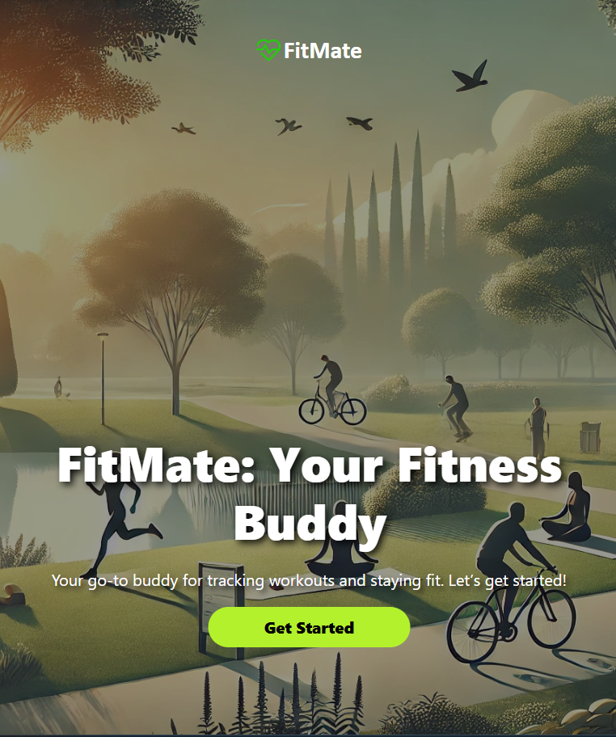
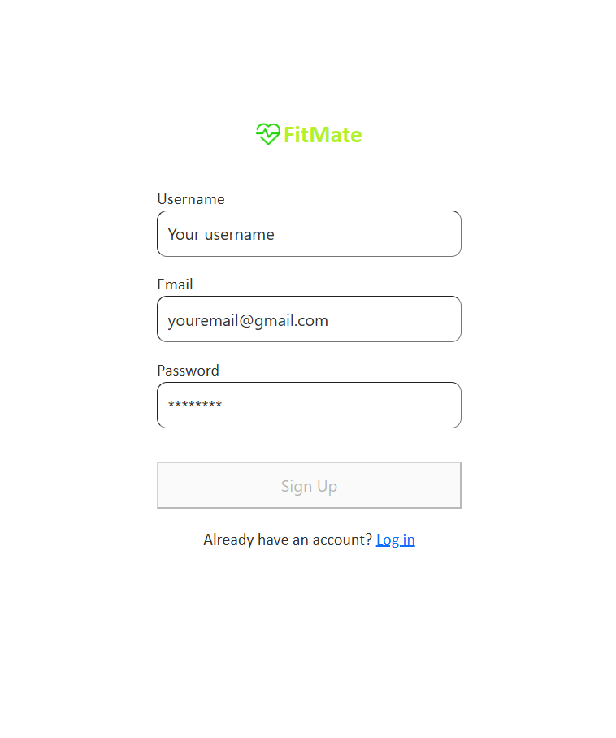
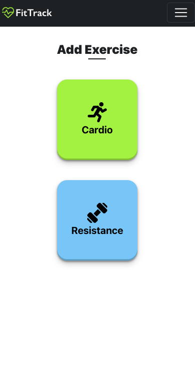
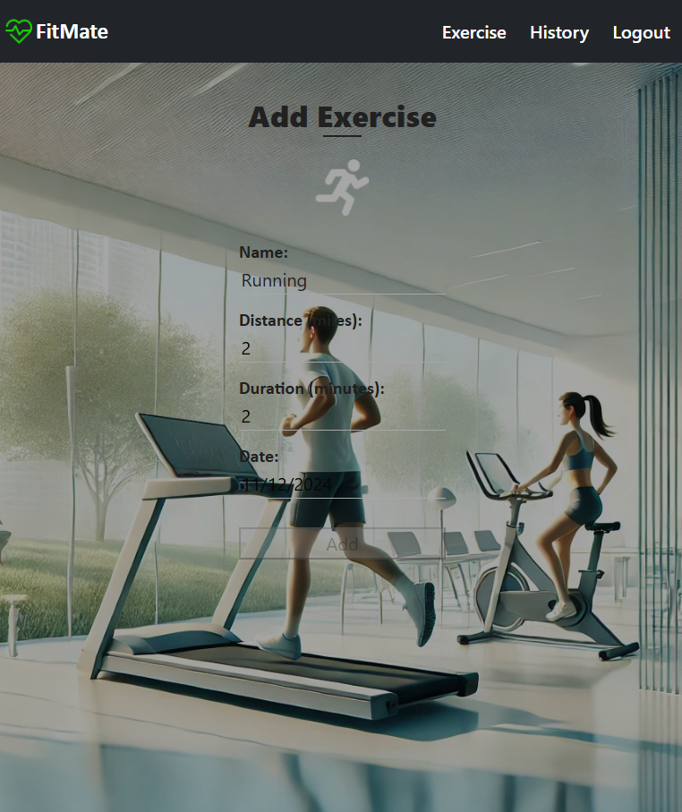
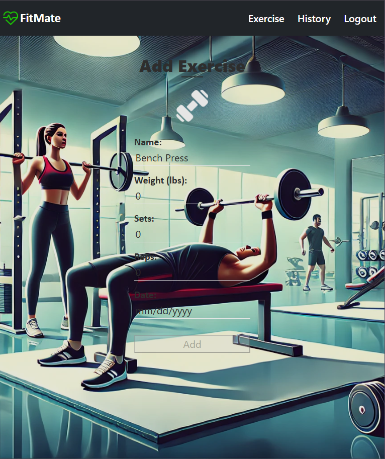
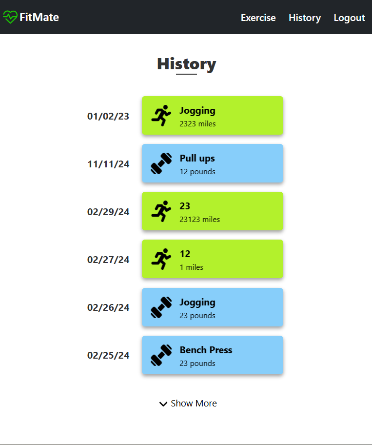

# FitMate: A MERN-Stack Fitness Tracker App 🏋️‍♂️💪

## Table of Contents 📚

- [FitMate: A MERN-Stack Fitness Tracker App 🏋️‍♂️💪](#fitmate-a-mern-stack-fitness-tracker-app-️️)
  - [Table of Contents 📚](#table-of-contents-)
  - [Description 📖](#description-)
  - [Technology ⚙️](#technology-️)
  - [Installation 🛠️](#installation-️)
  - [Usage 🚀](#usage-)
  - [Example Screenshots 📸](#example-screenshots-)
  - [License 📝](#license-)
  - [Contribution 🤝](#contribution-)
  - [Questions? 🤔](#questions-)

---

## Description 📖

**FitMate** is a user-friendly MERN-stack application that helps individuals track and manage their daily fitness routines. Whether you're doing cardio or resistance exercises, FitMate allows you to log your workouts, view your workout history, and delete exercises as needed.

Key Features:
- Log and track both cardio and resistance exercises 🏃‍♀️🏋️‍♀️
- View your workout history 📅
- Easily delete exercises 🗑️

---

## Technology ⚙️

This project was built using the following technologies:

- **Mongoose**: MongoDB object modeling
- **Express.js**: Web application framework
- **React.js**: Frontend user interface
- **Node.js**: JavaScript runtime environment
- **JWT Authentication**: Secure login system

---

## Installation 🛠️

To get started with **FitMate**, follow the steps below:

1. Clone this repository:
   ```bash
   git clone https://github.com/Agent-Twilight7/fitmate.git
   ```

2. Navigate into the project directory:
   ```bash
   cd fitmate
   ```

3. Install dependencies:
   ```bash
   npm install
   ```

---

## Usage 🚀

Once you have installed the necessary dependencies, run the app with the following command:

```bash
npm run develop
```

You can then access the app in your browser at: (Currently not available)

👉 [FitMate Live App](https://FitMate-mlvj.onrender.com)

---

## Example Screenshots 📸

Here are some screenshots of **FitMate** in action:

- **Home Page**  
  

- **Login Page**  
  

- **Exercise Page**  
  

- **Add Cardio**  
  

- **Add Resistance**  
  

- **History Page**  
  

- **Single Cardio History**  
  

- **Single Resistance History**  
  

---

## License 📝

This project is licensed under the [MIT License](https://opensource.org/licenses/MIT).  
Click the badge below to view the full license:

[](https://opensource.org/licenses/MIT)

---

## Contribution 🤝

- **Icons**: Designed by [Flaticon](https://www.flaticon.com)
- **Background Photos**: Sourced from [Pexels](https://www.pexels.com)
- **Made with ❤️ by** [Risa Chaudhari](https://github.com/Agent-Twilight7)

---

## Questions? 🤔

If you have any questions or need further information, feel free to reach out:

- 📧 [Email me](mailto:your.email@example.com)
- 🐙 [GitHub Profile](https://github.com/Agent-Twilight7)

